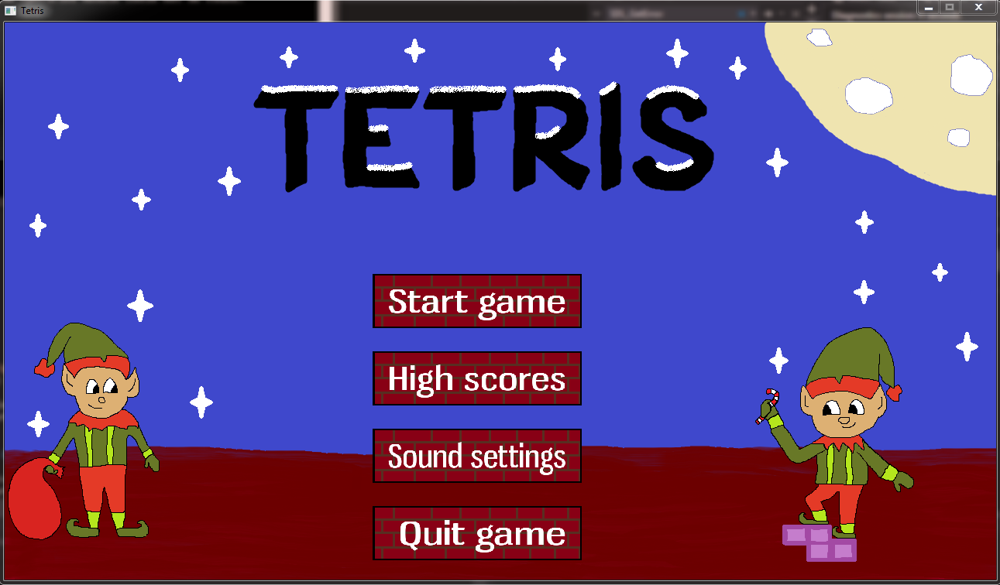
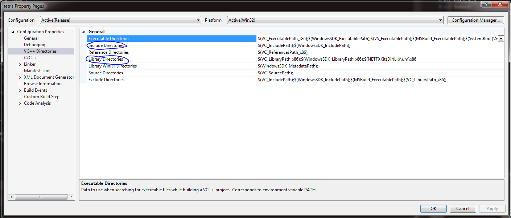
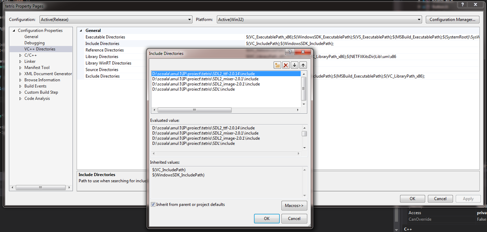
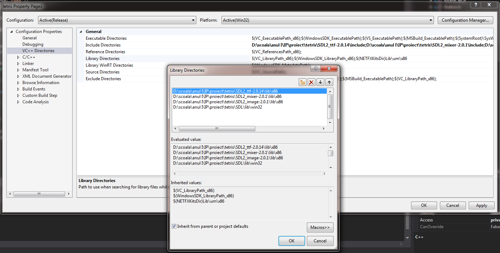
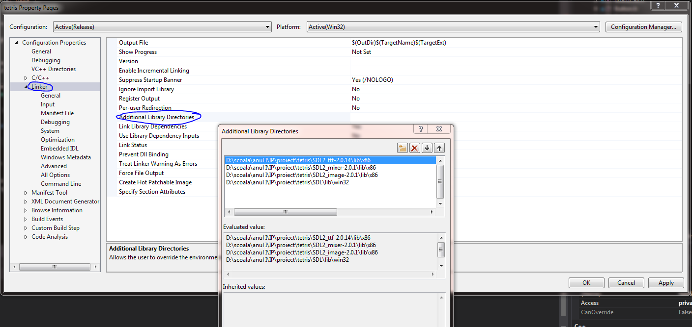
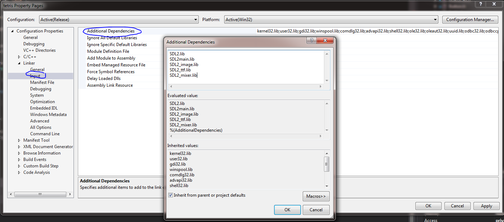
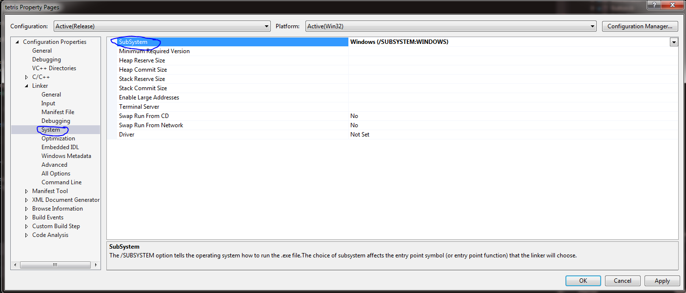

Pentru a rula proiectul in Visual Studio 2015, se efectueaza urmatoarele configurari:

In project -> tetris properties -> VC++ Directories se adauga Include Directories si Library Directories din folderele corespunzatoare bibliotecilor SDL2, SDL2-image, SDL2-mixer si SDL2-ttf, incluse in proiect.

In mod similar, in Linker se adauga aceleasi biblioteci dupa cum urmeaza:

In linker -> input -> additional Dependencies se adauga SDL2.lib, SDL2main.lib, SDL2_image.lib, SDL2_ttf.lib si SDL2_mixer.lib

In linker -> system se selecteaza SubSystem Windows

Pentru a rula jocul, din folderul Release se executa tetris.exe

Control:
stanga, dreapta - miscarea piesei
sus - rotirea piesei
jos - mareste viteza caderii
